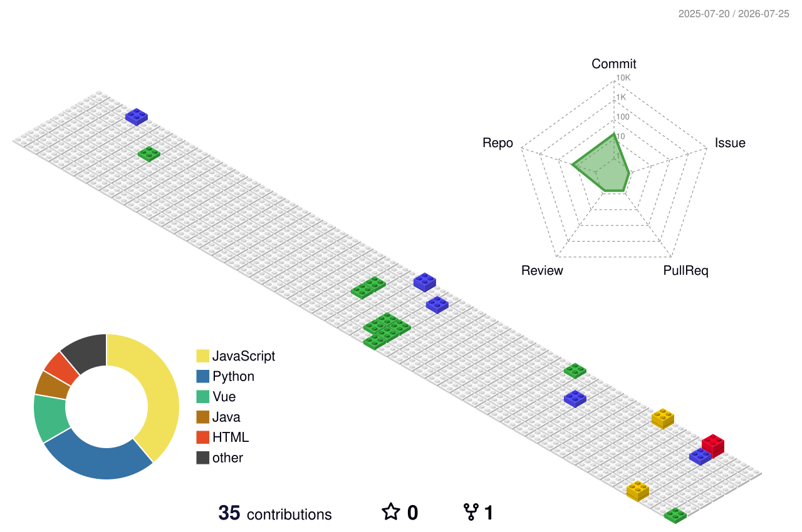

<h1 align="center">Hi 👋, I'm Wong Chou Zi</h1>

<h3 align="center">Student at University of Malaya · Web Development & Cybersecurity</h3>

  

---

## 💫 About Me

- 🔭 Studying at **University of Malaya**
- 🌱 Learning **web development** and **cybersecurity**

## 💻 Tech Stack

## 📊 GitHub Activity

  

