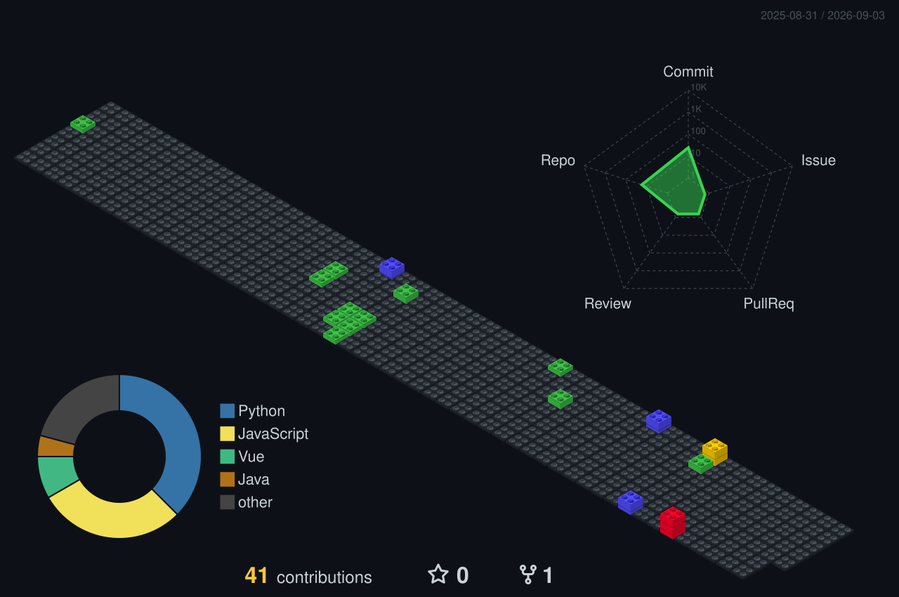

<p align="center">
  
  
</p>

<h3 align="center">⬥ CLASSIFIED PERSONNEL FILE ⬥</h3>
<p align="center"><code>DOSSIER // WZC-UM-2026 // EYES ONLY</code></p>

---

<details open>
<summary><b>🔓 INITIATE SECURE ACCESS — CLICK TO DECRYPT</b></summary>
<br>

```text
▓▓▓ SECURE CHANNEL ESTABLISHED ▓▓▓
> Handshake ............... OK
> Biometric scan .......... BYPASSED
> Decrypting payload ...... IN PROGRESS
> WARNING: Unauthorized access is monitored
```

<br>

<details>
<summary><b>📁 FILE 01 — Subject Identity [REDACTED]</b></summary>
<br>

| Field | Intel |
|:--|:--|
| **Codename** | `WONG CHOU ZI` |
| **Cover Identity** | Student, University of Malaya |
| **Specialization** | Web Development · Cybersecurity |
| **Secure Contact** | [LinkedIn Channel](https://linkedin.com/in/wong-chou-zi-4016b3233) |

```text
NAME:     ████████████ → WONG CHOU ZI
LOCATION: ████████████ → KUALA LUMPUR, MY
STATUS:   ████████████ → ACTIVE / ENROLLED
```

</details>

<details>
<summary><b>📁 FILE 02 — Active Mission Brief</b></summary>
<br>

```text
MISSION LOG // PRIORITY: ONGOING
────────────────────────────────
[01] Maintain deep cover at University of Malaya
[02] Advance web development capabilities
[03] Train offensive & defensive cyber operations
[04] Build public-facing operational footprint (GitHub)
```

- 🔭 **Current post:** University of Malaya
- 🌱 **Training:** Web development & cybersecurity

</details>

<details>
<summary><b>📁 FILE 03 — Armament Manifest (Tech Stack)</b></summary>
<br>


```text
INVENTORY STATUS: VERIFIED
WEAPONS CLEARED FOR FIELD USE
```

</details>

<details>
<summary><b>📁 FILE 04 — Transmission End / Burn After Reading</b></summary>
<br>

```text
> Session token revoked.
> This dossier will self-destruct in ███ seconds.
> ...
> Just kidding. Close this tab to "burn" the file.
```

</details>

</details>

---

## 📊 Field Activity Log

<p align="center">
  
</p>

<p align="center"><sub>INTEL SOURCE: GITHUB CONTRIBUTION FEED · AUTO-REFRESH DAILY</sub></p>
